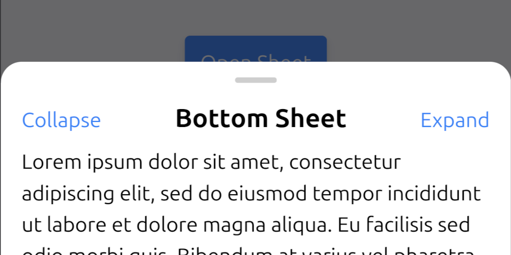

# React Bottom Sheet Component

[](https://www.npmjs.com/package/@wldyslw/react-bottom-sheet)
[](https://bundlephobia.com/package/@wldyslw/react-bottom-sheet)
[](https://bundlephobia.com/package/@wldyslw/react-bottom-sheet)



-   ⚡️ **PERFORMANT**: every motion is done purely with CSS transforms, providing near-native UX.
-   🪶 **LIGHTWEIGHT**: **~3.5kb** mifified UMD, **~2kb** gziped. **0 dependencies**.
-   🧘 **MINIMALISTIC**: nothing redundant, yet everything you may need.
-   ⚙️ **TYPED**: writen in TypeScript, so `.d.ts` file with prop and ref types included!

# Getting Started

1. Install the package:

```sh
pnpm install @wldyslw/react-bottom-sheet
```

2. Use it:

```js
import { useRef } from 'react';
import BottomSheet from '@wldyslw/react-bottom-sheet';
// don't forget styles! If you use TailwindCSS, you can include package to config.content and save even more precious kilobytes!
import '@wldyslw/react-bottom-sheet/lib/style.css';

function App() {
    const sheetRef = useRef(null);

    return (
        <>
            <button onClick={() => sheetRef.current?.open()}>Open Sheet</button>
            <BottomSheet ref={sheetRef}>Hello!</BottomSheet>
        </>
    );
}
```

# Docs

You can check API Reference as well as examples at official [docs page](https://wldyslw.github.io/react-bottom-sheet)

# License

MIT
